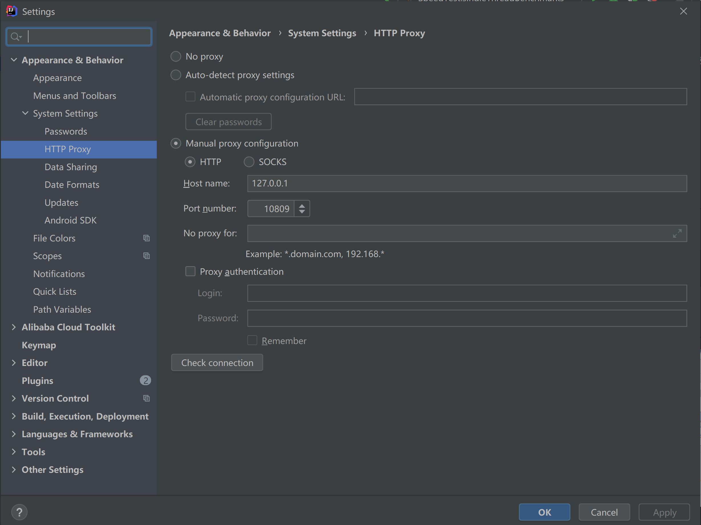
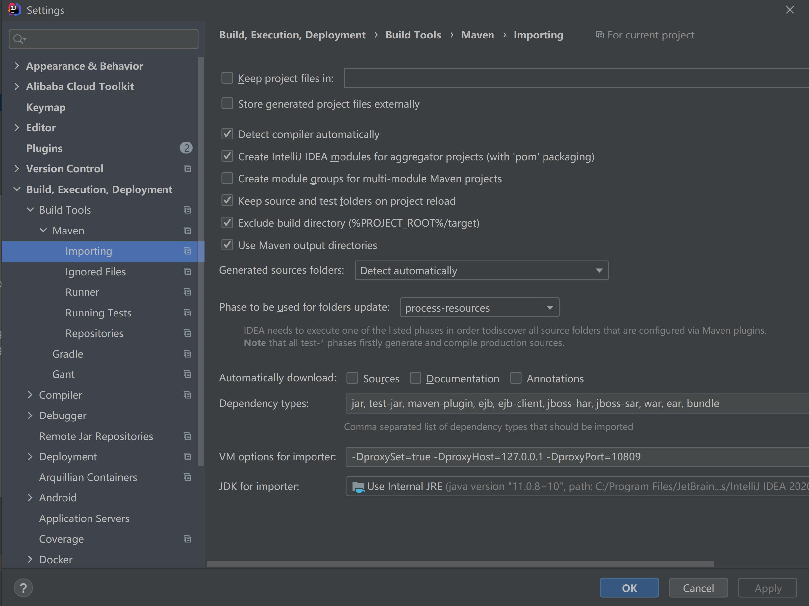
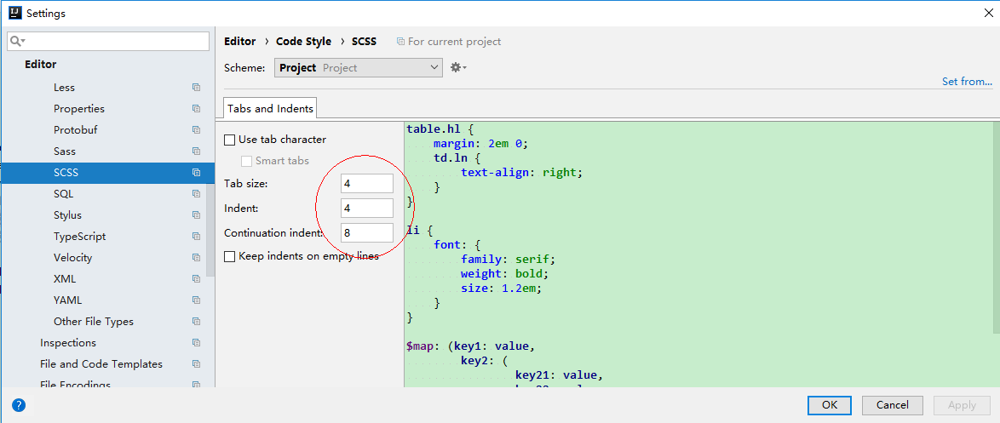

# Ⅰ. 环境搭建

## 1. Java安装

```
安装JDK11
配置环境变量：JAVA_HOME      D:\Java\JDK    （JDK安装的目录，既bin层之上的目录）
              Path            %JAVA_HOME%\bin   （通过JAVA_HOME确定bin的目录）
在cmd命令中运行：java -version ,有结果返回则表示安装成功
```

## 2. git使用默认的安装，选择git bash only

```
安装好以后，在git bash中输入：git --version，有结果返回则表示安装成功
```

## 3. nodejs安装

- 直接默认安装

```
查看npm是否安装成功：npm --version；  
查看nodejs是否安装成功：node --version；
```

- 在package.json文件右键,npm install安装依赖包

```
使用npm install安装需要的node module
安装完成后，在node module，和static上右键->mark Directory as->excluded
然后，File->Invalidate Cache/Restart
```

## 4. idea安装

## 5. rider安装

## 6. unity安装

# Ⅱ. IntelliJ相关设置

## 1 参数配置：Help->edit custom

- 自定义idea参数，edit custom properties

````
# 控制台输出缓存，如果不使用下面的参数，也可以在Setting->Editor->General->Console中设置
# idea.cycle.buffer.size=disabled
# 设置可读文件大小
idea.max.intellisense.filesize=50000
````

- 自定义jvm参数，edit custom vm operation

```
-Xms1024m
-Xmx8192m
-XX:ReservedCodeCacheSize=512m


-Dfile.encoding=UTF-8
-Duser.name=jaysunxiao
```

## 2 界面设置和编码设置（需要上面两步做完）

- 文件编码设置：File->Settings->Editor->File Encodings

```
Global Encoding:UTF-8
Projectt Encoding:UTF-8
Default encoding for properties files:UTF-8
BOM for utf8: No Bom
```

## 3 换行符设置

- 统一用Unix换行符：File->Settings->Editor->Code Style

```
Line separator，Unix and MacOs （\n）
```

## 4 代码模板设置

- 设置类模板：Editor->File and Code Templates->Includes

```
/**
 * @author jaysunxiao
 * @version 3.0
 */
```

- 版权信息设置：Editor->Copyright->Copyright Profiles

```
Copyright (C) 2020 The zfoo Authors
Licensed under the Apache License, Version 2.0 (the "License"); you may not use this file except
in compliance with the License. You may obtain a copy of the License at

http://www.apache.org/licenses/LICENSE-2.0

Unless required by applicable law or agreed to in writing, software distributed under the License is distributed
on an "AS IS" BASIS, WITHOUT WARRANTIES OR CONDITIONS OF ANY KIND, either express or implied.
See the License for the specific language governing permissions and limitations under the License.
```

# 5 代理设置

- idea代理设置
  

- maven代理设置，-DproxySet=true -DproxyHost=127.0.0.1 -DproxyPort=10809
  

## 6 使用Idea默认的快捷键设置

- 使用Cyan Light Theme主题
- Keymap->Main menu->Code->Completion->Basic，删除ctrl+空格，设置为ctrl+enter
- Run to Cursor，设置为F9
- find，设置为ctrl+f
- replace，设置为alt+f

### 4.2 服务器插件安装

- Alibaba Java Coding Guidelines
- Alibaba Cloud tool
- Power Mode 2
- zoolytic
- Maven Helper
- EasyApi
- vue.js
- jclasslib

### 4.3 web插件安装

- eslint
  

## 4.4 格式设置

- CSS格式设置
- SCSS格式设置
  

- JSON格式设置
  

- HTML格式设置
- XML格式设置
- VUE格式设置
  
  

## 4.5 浏览器

1. Google浏览器为默认安装方法
2. 在google浏览器上安装vue devtools插件。
3. react devtools插件
4. WEB前端助手插件

## 5.Lingoes安装

- 在电脑管家上下载也可以，直接默认安装
  
  
  

```
在下面的文件夹下，将Lingoes English.zip解压到这个目录下
C:\Users\Administrator\AppData\Local\Lingoes\Translator\user_data\speech
重启Lingoes，在设置->语言中，选择声音，英语
```
