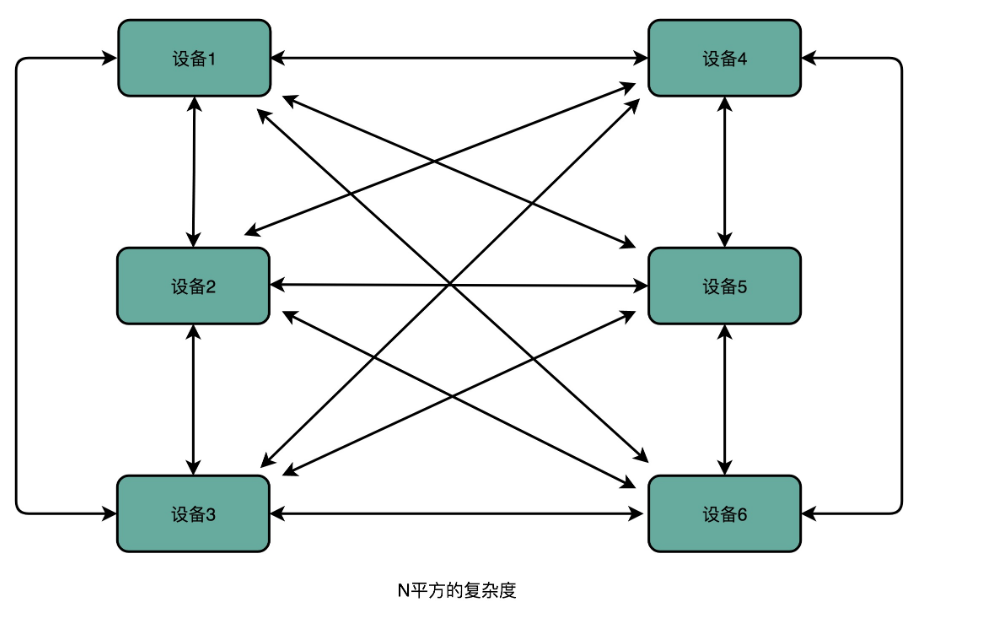
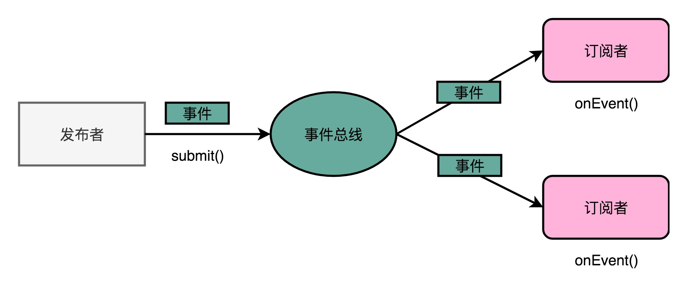

### Ⅰ. 简介

- [event](https://github.com/zfoo-project/zfoo/blob/main/event/README.md) 事件总线解耦不同模块，提高代码的质量，核心思想是观察者设计模式

### Ⅱ. 硬件层面的事件总线

#### 1. 设备间的通信，直连的方式

CPU所代表的控制器和运算器，要和存储器，也就是我们的主内存，以及输入和输出设备进行通信。 计算机是用什么样的方式来完成，CPU和内存、以及外部输入输出设备的通信呢？

比如我在键盘上输入一个快捷键，来控制我的音响播放音乐，计算机是用什么样的方式来完成，外部输入输出设备的通信呢？

#### 2. 通过总线降低复杂度

#### 3. 硬件总线的多重架构

总线的设计思路，核心是为了减少多个模块之间交互的复杂性和耦合度。

在实际的硬件层面，总线其实就是一组连接电路的线路。因为不同设备之间的速度有差异，所以一台计算机里面往往会有多个总线。

实际上，总线这个设计思路在我们的软件开发过程中也经常会被用到。事件总线就是我们常见的一个设计模式，通常事件总线也会和订阅者发布者模式结合起来，成为大型系统的各个松耦合的模块之间交互的一种主要模式。

### Ⅲ. 软件层面的事件总线

- 事件总线从设计模式上说叫观察者模式
- 设计模式没有固定的写法，zfoo event用最简单的注解实现了事件总线
- zfoo event使用Javassist字节码增强技术动态代理事件接收者，避免了反射，没有性能损耗

### Ⅳ. 参考文章

- [深入浅出计算机组成原理学习笔记：第四十二讲](https://www.cnblogs.com/luoahong/p/11359768.html)
